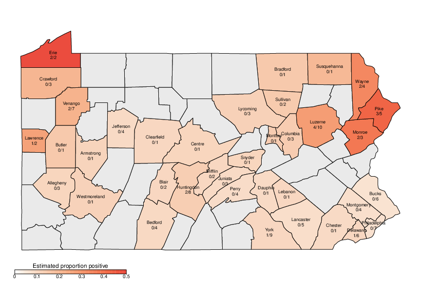

# Analysis code for county positivity for the paper "Multiple Introductions of SARS-CoV-2 Alpha and Delta Variants into White-Tailed Deer in Pennsylvania"

To run the code, start R and `source('analyze.R')` in this directory. The code depends on these packages available from CRAN:

* parallel
* rstan
* maps
* viridis

## Bayesian analysis of county proportions

To account for the variable sampling between counties and potential
similarities between neighboring counties, we estimated the underlying
proportion of deer testing positive within each county of the $m$
counties using a Bayesian conditional autoregressive model. The number
of positive tests, $y_{i}$, out of $n_{i}$ total tests within each
county $i$ was modeled as:

$y_{i}\sim \mathrm{Binomial(}p_{i},n_{i}\mathrm{)}$

where $p_{i}$ is the proportion of deer expected to test positive in
that county and:

$p_{i} = \mathrm{\text{logit}}^{- 1}\left( \alpha + \beta_{i} \right)$

Here, $\alpha$ represents the average proportion positive for a county
and the vector of differences from this average for each county,
$\beta$, is distributed as a multivariate normal:

$\beta\sim \mathrm{\text{Normal}}_{\mathrm{\text{prec}}}\mathrm{(0,}\frac{1}{\mathrm{\sigma}}\mathrm{(}\mathrm{D}\mathrm{-}\mathrm{\theta}\mathrm{A}\mathrm{))}$

where $\mathrm{D}$ is a $m \times m$ matrix with 0s on the off diagonal and the
diagonal element on each row $i$, $D_{i,i}$, equal to the number of
counties that are adjacent to county $i$, $A$ is a $m \times m$
adjacency matrix with element $A_{i,j}$ is 1 if county $i$ neighbors
county $j$ and 0 otherwise and the diagonal set to 0 and
$\mathrm{\text{Normal}}_{\mathrm{\text{prec}}}\left( x,y \right)$ is a
multivariate normal distribution with means $x$ and precision matrix
$y$. For priors, $\mathrm{\theta}$ was given a uniform prior between 0
and 1, $\mathrm{\sigma}\ \mathrm{Gamma(}\mathrm{1,1)}$ and
$\mathrm{\alpha}\ \mathrm{Normal( - 2,10)}$.

Posterior probability distributions were estimated using Markov chain
Monte Carlo sampling using Stan v2.21.0.

County adjacency data was obtained from the 
[US Census Bureau](https://www.census.gov/geographies/reference-files/2010/geo/county-adjacency.html).

